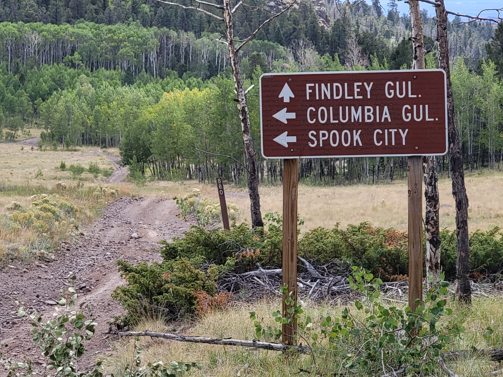

# OSM Merge

<!-- markdownlint-disable -->

  <em>Merge features and tags into existing OSM data.</em>

  
  
  
  
  
  
  
  

---

📖 **Documentation**: <a href="https://hotosm.github.io/osm-merge/" target="_blank">https://hotosm.github.io/osm-merge/</a>

🖥️ **Source Code**: <a href="https://github.com/hotosm/osm-merge" target="_blank">https://github.com/hotosm/osm-merge</a>

---

<!-- markdownlint-enable -->

## Background

This is a project for conflating map data,
with the ultimate goal of importing it into
[OpenStreetMap](https://www.openstreetmap.org). It
is oriented towards processing non OSM external datasets.

This project uses a huge amount of data (and disk space) if you start
from the original nation wide datasets, which are too large to
edit. There is a contrib script in the git sources I use to start
breaking down the huge files into managable pieces.

The goal of this project is two-fold. One is to support field data
collection using OpenDataKit. The
[osm-fieldwork](https://hotosm.github.io/osm-fieldwork/) project can
be used to convert the ODK data files into GeoJson and OSM XML. This
project then supports conflating that field collected data with
current OpenStreetMap. Otherwise this is a time-consuming process to
do manually.

The other goal is focused on emergency access in remote areas. This is
improving the Motor Vehicle Use Map (MVUM) datasets of all highways
(mostly jeep trails) in OpenStreetMap.  The current data in OSM was
often imported complete with bugs in the original dataset, or the only
details are *highway=track*. All of these have a US forest service
reference number and name. Adding those makes it much easier to
communicate a location.

{width=300 height=200}

## Programs

### conflator.py

This program doesn't require a database, unlike the other conflation
programs. It is focused on [conflating OpenDataKit](odkconflation.md)
with OpenStreetMap, as well as conflating [rural
highways](highways.md). It'll conflate any two datasets in either GeoJson
or OSM XML format. While this is currently under heavy development and
debugging by processing large amounts of data to track down all the
obscure bugs in the original datasets, or the conflation process.

### The Data

Much of the process of conflation is splitting huge datasets into
managable sized files. Since that process is [mostly
automated](https://github.com/hotosm/osm-merge/tree/main/contrib), I
have a collection of files where I have done that part. Since
conflation also requires converting the original datasets, the
original files are included, the converted files to OSM XML & GeoJson,
and the results of conflation. Not all the national forests and parks
have been conflated yet, but the data is there for others that may
wish to try. The [Map
Data](https://www.senecass.com/projects/Mapping/SourceData/States/) is
on a slow server, sorry. Disk space is cheaper than network bandwidth.

{width=300 height=200}

