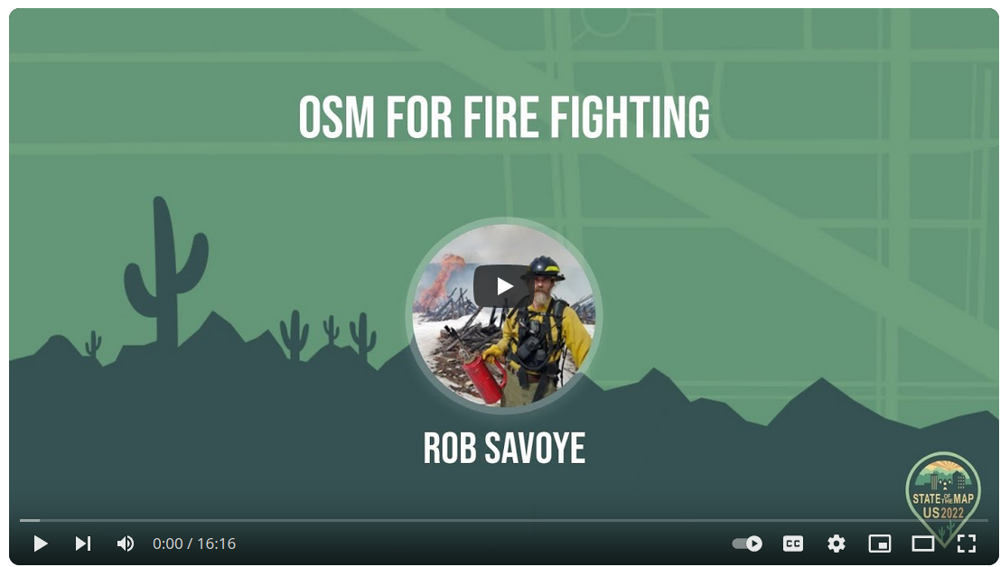
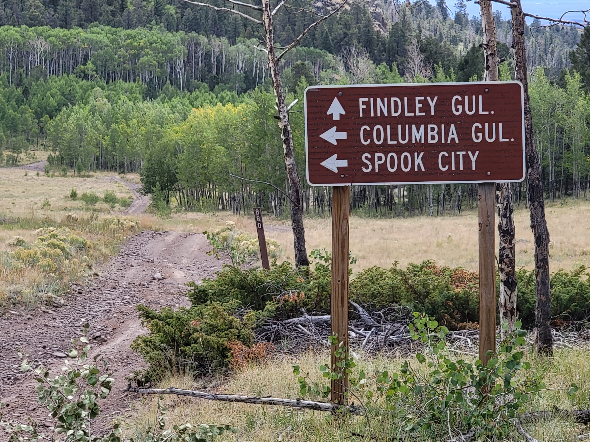

# Conflating Highway and Trail Data

This is focused only on highway and trail data in the US, but should
be useful for other countries. In particular, this is focused on the
primary goal of improving OpenStreetMap data in remote areas as these
are used for emergency response. Most of these roads and trails are in
OSM already, some from past imports, some traced off of satellite imagery. 

I did a talk at SOTM-US in Tucson about this project called
[OSM For Fire
Fighting](https://www.youtube.com/watch?v=qgk9al1rluE). This
conflation software was developed to improve the quality of the remote
highway data in OpenStreetMap. This is not an import of new data, only
updating existing features with a focus on improved
navigation. Importing new features from these datasets uses a
different process, so it's better to not mix the two.

{width=300 height=200}

While there are details in the the datasets that would be useful, the
initial set is the name, the reference number, and the vehicle class
appropriate for this highway. Not this can change over time, so if the
*smoothness* tag is in the OSM feature, it's assumed that value is
more accurate.

The primary purpose is to clean up the [TIGER import
mess](https://wiki.openstreetmap.org/wiki/TIGER_fixup), which is often
inaccurate. This leads to navigation problems as sometimes what is in
OSM is not what the street sign says. Since there are multiple
datasets supplied by government agencies with a good license for OSM,
we data mine these through conflation to get the best name and
reference number.

Although most of the fields in these datasets aren't useful for OSM,
some are like is it a seasonal road, various off road vehicle access
permissions, etc... since this is also useful for navigation. Any tags
added or edited will follow the [OSM Tagging
Guidelines](https://wiki.openstreetmap.org/wiki/United_States_roads_tagging#Tagging_Forest_Roads)lh

for forest roads.

# The Datasets

The primary source of these datasets is available from the 
[FSGeodata Clearinghouse](https://data.fs.usda.gov/geodata/edw/datasets.php?dsetCategory=transportation),
which is maintained by the [USDA](https://www.usda.gov/).

The Topographical map vector tiles are
[available from
here.](https://prd-tnm.s3.amazonaws.com/index.html?prefix=StagedProducts/TopoMapVector/),
which is maintained by the National Forest Service.

These have been partially imported in some areas in the past, complete
with the bugs in the original datasets. One big advantage though is
that the geometry in OSM was from the same USDA datasets at some point
in the past, so it's relatively easy to match the
geometries. Conflation then is mostly working through the name and
reference fields between multiple files, which sometimes don't agree
on the proper name.

And OpenStreetMap of course.

## Processing The Datasets

Since the files are very large with different schemas, a critical
part of the conflation process is preparing the data. Some of these
files are so large neither QGIS or JOSM can load them without
crashing. I use two primary tools for splitting up the
files. [ogr2ogr](https://gdal.org/programs/ogr2ogr.html) for the
GeoJson files, and [osmium](https://osmcode.org/osmium-tool/) for the
[OSM XML](https://wiki.openstreetmap.org/wiki/OSM_XML) files. The OSM
XML format is required if you want the conflation process to merge the
tags into an existing feature. If conflating with OSM data using the
GeoJson format, you need to manually cut & paste the new tags onto the
existing feature.

As you furthur reduce large datasets to smaller more manageble pieces,
this can generate many files. The top level choice is the largest
category. I use National Forests bopundaries as they can cross state
lines.

All of the datasets have issues with some features lacking a
geometry. These appear to be duplicates of a Feature that does have a
good geometry. They are also in "NAD 83 - EPSG:4269" for the CRS, so
need to convert and fix the geometries. I use *ogr2ogr* to convert the
GDB files to GeoJson like this:

	ogr2ogr Road_MVUM.geojson S_USA_Road_MVUM.gdb.zip -makevalid -s_srs EPSG:4269 -t_srs EPSG:4326 -sql 'SELECT * FROM Road_MVUM WHERE SHAPE IS NOT NULL'

	ogr2ogr Trails_MVUM.geojson S_USA_Trail_MVUM.gdb.zip -makevalid -s_srs EPSG:4269 -t_srs EPSG:4326 -sql 'SELECT * FROM Trail_MVUM WHERE SHAPE IS NOT NULL'

This generates a clean GeoJson file. It has many fields we don't want,
so I run a simple [conversion program](utilities.md) that parses the
fields are defined in the original file, and converts the few fields
we want for conflation into the OSM equivalant tag/value. For
conflation to work really well, all the datasets must use the same
schema for the tags and values.

Since the MVUM dataset covers the entire country, I build a directory
tree in which the deeper you go, the smaller the datasets are. I have
the Nationl Forest Service Administrative boundaries unpacked into a
top level directory. From there I chop the national dataset into just
the data for a forest. This is still a large file, but manageble to
edit. Sometimes with rural highway mapping, a large area works
better. If there are plans to use the [Tasking
Manager](https://tasks.openstreetmap.us/), The files are still too
large, as TM has a 5000sq km limit.

Next is generating the task boundaries for each national forest
that'll be under the 5000km limit. I used the 
[FMTM Splitter](https://hotosm.github.io/fmtm-splitter/) program to
use the national forest boundary and break it into squares, and
clipped properly at the boundary. These task boundary polygons can
then be used to create the project in the Tasking Manager, which will
furthur split that into the size you want for mapping.

### The OpenStreetMap Extract

This step is unnecessary if you plan to manually conflate with a
GeoJson file, so jump ahead to the next section.

To conflate against OSM data with the goal of automatically merging
the tags into the feature you have to prepare the dataset. Each
feature needs to be validated anyway, merging tags is more efficient
than cut & paste. Since this project is processing data from multiple
US states, it exceeds the [Overpass](https://overpass-turbo.eu/) data
size.

I download the states I want to conflate from
[Geofabrik](http://download.geofabrik.de/north-america.html), and then
use [osmium
merge](https://docs.osmcode.org/osmium/latest/osmium-merge.html) to
turn it into one big file. I have to do this because most of the
national forest cross state lines. You'll get duplicate ID errors if
you download these files on different days, so grab all the ones you
plan to merge at the same time. Geofabrik updates every 24 hours. When
dealing with files too large for JOSM or QGIS,
[osmium](https://osmcode.org/osmium-tool/) is the tool to use. There
is also [osmfilter](https://wiki.openstreetmap.org/wiki/Osmfilter) and
[osmconvert](https://wiki.openstreetmap.org/wiki/Osmconvert) which can
be used as well. [Ogr2ogr](https://gdal.org/programs/ogr2ogr.html)
can't be used as it can't write the OSM XML format. To merge multiple
files with osmium, do this:

	osmium merge --overwrite -o outdata.osm *.osm.pbf
  
The next step is to delete everything but highways from the OSM XML
file. When conflating highways, we don't care about amenities or
waterways.

	osmium tags-filter --overwrite --remove-tags -o outdata.osm indata.osm w/highway=track,service,unclassified,primary,tertiary,secondary,path,residential,abandoned,footway,motorway,trunk

Finally I clip this large file into separate datasets, one for each
national forest.

	osmium extract --overwrite --polygon boundary.geojson -o outdata-roads.osm 

Then the real fun starts after the drudgery of getting ready to do
conflation.

{width=300 height=200}

#### Forest Road Names

The names and reference number in OSM now have a wide variety of
[incorrect
tagging](https://wiki.openstreetmap.org/wiki/United_States_roads_tagging#National_Forest_Road_System)
when it comes to names. *"Forest Service Road 123.4A"* is not a name,
it is a reference number. Same for *"County Road 43"*.  The
[fixname.py](https://github.com/hotosm/osm-merge/blob/tagging/utilities/fixnames.py)
utility scan the OSM extract and when it see incorrect tagging,
correct it to the OSM standard. Since the external datasets already
follow the same guidelines, this increases the chance of a good match
when conflating, since comparing names is part of the process.

#### TIGER Tag Deletion

Since there is community consensus that the *tiger:* tags added back
in 2008 when the TIGER data was imported are meaningless, so should be
deleted as bloat. The *fixnames.py* utility used for correct the name
alos deletes these from each feature so you don't have to manually do
it.

### MVUM Roads

This is all the highways in National Forests. The data contains
several fields that wopuld be useful in OSM. This dataset has a
grading of 1-5 for the type of vehicle that can drive the road, as
well as a field for high clearance vehicles only. This is roughly
equivalant to the *smoothness* tag in OSM. The surfce type is also
included, which is the same as the OSM *surface* tag. There are other
fields for seasonal access, and seasonal road closures. Roads tagged
as needing a high clearance vehicle generate a *4wd_only* tag for OSM.

The reference numbers often have a typo, an additional number (often 5
or 7) prefixed to the actual number in the original dataset, and were
imported this way. Since the reference number needs to match what the
map or street sign says, these all need to be fixed. And there are
thousands of these...  

The type of vehicle that can be driven on a particular road is a bit
subjective based on ones off-road driving experience. These are
typically jeep trails of varying quality, but very useful for
backcountry rescues or wildland fires.

### Mvum Trails

These are Multi Vehicle Use Maps (MVUM), which define the class of
vehicle appropriate to drive a road. The trails dataset contains
additional highways, as some hikiing trails are also forest service
roads. These are primarily for hiking, but allow vehicle use,
primarily specialized off-road vehicles like an ATV or UTV. They
suffer from the same bad data as the MVUM roads.

### National Forest Trails

This dataset is hiking trails that don't allow any vehicle usage at
all. Many of these trails are in OSM, but lack the trail name and
reference number. These also get used for emergency response as
well. If there is a name and reference number for the trail, this
makes it easier to refer a location to somebody over a radio instead
of GPS coordinates.

### USGS Topographical maps

It's possible to download the vector datasets used to produce
topographical maps. Each file covers a single 7.5 map quad, which is
49 miles or 78.85 km square. There are two variants for each quad, a
GDB formatted file, and a Shapefile formatted file. The GDB file
contains all the data as layers, whereas the Shapefiles have separate
files for each feature type. I find the smaller feature based files
easier to deal with. The two primary features we want to extract are
**Trans_RoadSegment** and **Trans_TrailSegment**. Because of the
volume of data, I only have a few states downloaded.

I then used *ogrmerge* to produce a single file for each feature from
all the smaller files. This file covers an entire state. This file has
also has many fields we don't need, so only want the same set used for
all the datasets. The
[usgs.py](https://github.com/hotosm/osm-merge/blob/main/utilities/usgs.py)
contained in this project is then run to filter the input data file
into GeoJson with OSM tagging schema. The topographical data is
especially useful for conflation, since the name and reference number
match the paper or GeoPDF maps many people use.

## Conflation

Once all the datasets are broken into manageble peices, and everything
is using the OSM tagging schema conflation can start. There are two
datasets specified, one is the primary, and the other is the
secondary. The tag values in the primary will override the values in
the secondary file. To be paranoid about the details, when a tag value
is overwritten by the primary data source, the current value becomes
*old_*, ie... *name* becomes *old_name*, and then name is updated to
the current value. Sometimes when editing the difference in the names
is due to abbreviations being used, spelling mistakes, etc... so the
*old_name* can be deleted.

When conflating multiple datasets, those need to
be conflated against each other before conflating with OSM. Since the
topographical dataset is what matches a paper map, or GeoPDF, I
consider that the primary dataset. The MVUM and trail data are
particularly full of mistakes. Sometimes one dataset has a name, and
the other doesn't, so conflation here produces that value.

There are also many, many highways in these areas that in OSM only
have **highway=something**. These are easy to conflate as you are only
adding new tags. While in TIGER there are many
**highway=residential**, that should really be
**highway=unclassified** or **highway=track**, it is entirely possible
it is a residential road. There's a lot of nice cabins way out in most
national forests. But this is the type of thing you'd really need to
ground-truth, and luckily doesn't effect navigation when you are out
in a network of unmaintained dirt roads.

{width=300 height=200}

### Editing in JOSM

Unfortunately manually validating the data is very time consuming, but
it's important to get it right. I use the *TODO* plugin and also a
data filter so I just select highways. With the TODO plugin, I add the
selected features, ideally the entire task. Then I just go through all
the features one at a time. When the OSM XML dataset is loaded,
nothing will appear in JOSM. This is because the OSM XML file produced
by conflation has the refs for the way, but lack the nodes. All it
takes is selecting the *update modified* menu itm under the *File*
menu and all the nodes get downloaded, and the highways appear.

I often have the original datasets loaded as layers, since sometimes
it's useful to refer back to when you find issues with the
conflation. Much of the existing data in OSM has many unused tags
added during the TIGER import. These also get deleted as meaningless
bloat. Some were imported with all the tags from the original dataset
which also get deleted. This is life as a data janitor...

Once you've validated all the features in the task, it can be run
through the JOSM validator, and if all is good, uploaded to OSM. Often
the JOSM validators find many existing issues. I fix anything that is
an error, and mostly ignore all the warning as that's a whole other
project.

If you are editing with the OSM XML file produced by conflation, when
the file is opened, there will be some conflicts. This is usually due
to things like the incorrect forest road name getting deleted, since
now it's a proper *ref:usfs* reference number. And the tiger tags are
gone as well if the *fixnames.py* utility is used. To fix the
conflicts, I just select them all, and click on *resolve to my
version*. Then I load all the ways into the
[TODO](https://wiki.openstreetmap.org/wiki/JOSM/Plugins/TODO_list)
plugin.

Usng the plugin to validate a feature all I have to do is click on the
entry. Sometimes there will be issues that need to be manually
fixed. If conflation has changed the name, the old one is still in the
feature so a manual comparison can be done. Sometimes there are weird
typos that have slipped through the process. But many times for these
remote highways you can just mark it as done, and go on to the next
one. This lkets you validate a large number of features relatively
quickly without sacrifing quality.

#### Editing OSM XML

The conflation process produces an output file in OSM XML format. This
file has incremented the version number and added *action=modify* to
the attributes for the feature. When loaded into OSM, no data is
initially visible. If you go to the File menu, go down and execute
*update modified*. This will download all the nodes for the ways, and
all the highways will become visible. Highways that have multiple tags
already in OSM will become a conflict. These can be resolved easier in
JOSM using the conflict dialog box. No geometries have changed, just
tags, so you have to manually select the tags to be merged. Features
without tags beyond **highway=something** merge automatically. which
makes validating these features quick and easy. Note that every
feature needs to be validated indivigually.

#### Editing GeoJson

While JOSM can load and edit GeoJson data, not being in a native OSM
format it can't be automatically merge. Instead load the GeoJson file
and then create a new OSM layer. I select all the highways in the
task, and load them into the TODO plugin. Sometimes there are so few
highways, I don't use the TODO plugin. I then cut the tags and values
for a feature from the GeoJson file, then switch to the OSM layer, and
paste the tags into the feature.

#### Splitting Highways

In national forest lands, the reference number changes at every major
intersection. Side roads that branch off have an additional modifier
added. or example, the main road may be called *ref:usfs="FR 505"*,
with a change to *ref:usfs="FR 505.1"* when it crosses a state
line. Spur roads (often to campsites) get a letter attached, so the
spur road is *ref:usfgs="FR 505.1A". Understanding how the reference
numbers are assigned makes it easy to transmit your location over a
rado or phone, and have somebody looking on a map find that
location. Much easier than using GPS coordinates.

For the highways that were traced off of satellite imagery, there is
often a problem with forks in the road. Often tree cover or poor
resolution imagery makes it hard to see the highway. And a lot of the
highways go through an area with an entire network of other dirt
roads, so the reference number may just group a bunch of highway
segments. Often the most visible highway branch in the imagery at a
fork is not the actual road. In this case the highway has to be split
at the fork, and the new segment tagged for it's actual value, and the
actual highway segment gets tagged correctly. This is critical if you
want navigation to work.

## Ground-truthing

If you really want detailed and accurate maps, ground-truthing is an
important part of the process. Road conditions change, especially the
unmaintained dirt roads. Years of erosion, off-road vehicle abuse,
etc... all change. For this reason the *surface*, *smoothness* and
*tracktype* tags are not merged, as what is in the external datasets
is likely out of date. Also sometimes parts of a dirt road get paved,
or access is closed off completely.

This is a good excuse to go there for some hiking and camping fun. You
can load data into [StreetComplete](https://streetcomplete.app/) when
online, and then use that in the field since will likely be no cell
phone connection. Depending on the software used to collect the data,
that may need conflation before uploading, for example OpenDataKit
data. Some detail on that process is in this [Highway
Mapping](https://www.senecass.com/projects/Mapping/tech/HighwayMappingwithODK.html)
blog post about a field mapping trip.
