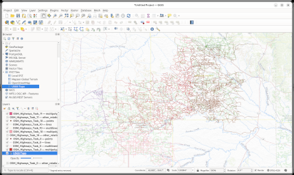
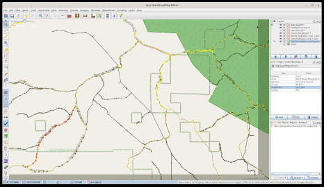
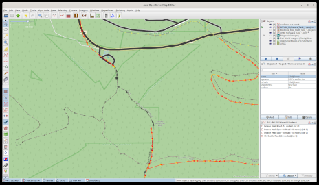
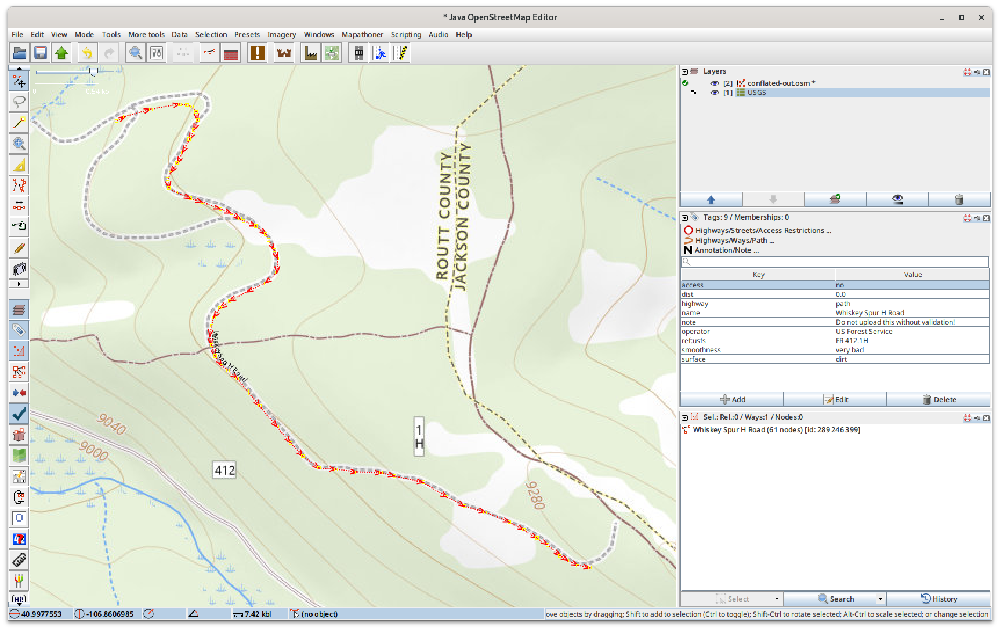
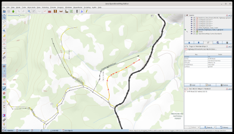
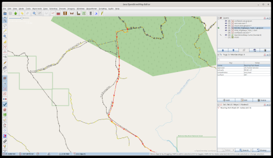
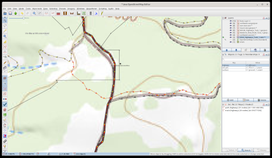

# Validating The Conflation

Every feature must be validated before it can be uploaded to
OpenStreetMap. OSM discourages machine editing without human
intervention. This software doesn't make any geometry changes, just
tags. At it's core, conflation is just merging tags between datasets
to avoid tedious cut & paste. But this still needs to be validated as
bugs and inconsistencies in the datasets can sneak in.

[{width=300 height=200}](http://5.78.72.214/fieldmapper/images/qgishighways.png)

## My Process

I have the two datasets that I was conflating loaded as layers in
JOSM so I can check the original sources easily if needed. Since these
are remote highways and trails, I use the USGS topographical
basemap in JOSM. Course that can also lead to confusion as sometimes
the reference number in the basemap has been truncated. When in doubt,
I reference the latest dataset from the national forest service, which
is the most correct. [That
dataset](https://usfs.maps.arcgis.com/home/group.html?id=1c9d890b197c4b2f9d72604b77ea43cb#overview)
is in
[vtpk](https://usfs.maps.arcgis.com/home/group.html?id=1c9d890b197c4b2f9d72604b77ea43cb#overview)
format, so doesn't work in JOSM, so I run it in QGIS.

### Debug Tags

Currently a few tags are added to each feature to aid in validating
and debugging the conflation algorythm. These should obviously be
removed before uploading to OSM. They'll be removed at a future date
after more validation of the software. These are:

* hits - The number of matching tags in a feature
* ratio - The ratio for name matching if not 100%
* dist -  The distance between features
* angle - The angle between two features
* slope - The slope between two features

If a feature has 3 hits, that's probably an exact match. One hit is
sufficient if there are no other nearby highways or trails. Two hits
usually means the name and reference number matched. If a highway only
contains *highway=path*, but the distance is very small, and there are
no other nearby features, it's assumed to be a match. Modifying the
current thresholds for distance, angle, and slope changes the results,
so having these as temporary tags in the feature is useful when
validating conflation results.

## Missed Highway

Sometimes you see an external trail or highway that is not in the
conflated data. This is because that highway is not currently in OSM,
so we ignore it since we're focused on existing features. When you
have the external dataset and OSM loaded in JOSM as layers, this
screenshot shows the other layers under the conflated data and show as
black lines. It's easy to see which layer it came from by toggling the
layers on and off.

[{width=300 height=200}](http://5.78.72.214/fieldmapper/images/mvum-osm.png)

The conflation software can also produce a data file of highways in
the MVUM dataset that aren't in OSM. Importing those is a different
process, so not discussed here. The conflation software can also
produce a data file of all the trails in OSM that are not in any
official sources.

## Missing Segments

Sometimes the external datset has missing segments, where OSM has the
entire highway. You can see in this screenshot of an MVUM highway
on top of an OSM basemap. The MVUM highway is missing the middle
segment. The conflation software sucessfully merges the tags from the
external dataset to the complete OSM highway feature.

[{width=300 height=200}](http://5.78.72.214/fieldmapper/images/missingsegments.png)

Currently any features that are an exact match between the external
dataset and OSM are not in the conflated output to reduce the data
that needs to be validated. If you have OSM loaded into a layer in
JOSM, the matched segments will be black lines.

## Reference Numbers Don't Match

If you are using the USGS topographical basemap, you can't depend on
it for the official reference number. Often the reference numbers in
the basemap are truncated, so you may think there is a problem. The
reference number in the MVUM dataset is the correct one.

[{width=300 height=200}](http://5.78.72.214/fieldmapper/images/badtopo2.png)

The other issue with reference numbers is also related to them being
truncated. Older versions of the external datasets are often missing
the __.1__ suffix. All the newer versions of the MVUM dataset and the
USGS topographical maps do have the full reference number with the
__.1__ appended. Depending on when the data was imported into OSM, it
may be lacking the __.1__ suffix.

### Proper Abbreviation

The community accepted abbreviation for __Forest Service Road__ is
*FR*. The MVUM dataset of course lacks this abbreviation, but it's
added when converting the MVUM dataset to OSM. In OSM there is a wide
variety of variations on this, some examples are *usfs *, *usfsr*,
*FD*, *FS*, etc... The conversion process also looks for these and
makes them consistent with OSM by using only *FR*. If they are
converteds, the existing value in OSM is renamed to *old_ref*, so when
validating the conflated data, you'll see both, and the old value can
be deleted.

### Proper Tag

One of the wonderful things about the flexibility of thw data schema
to support multiple values for the same feature. An MVUM highway will
of course have a reference number, but it may also have a county
reference number.

Based on a long discussion on the OSM Tagging email list a few years
ago, the consensus was to use __ref__ for the county reference number,
and __ref:usfs__ for the forest service number. The OSM carto will
display anything with a __ref*__ tag. The conflation process also
looks for a forest service reference number under a _ref__ tag, and
changes it to use __ref:usfs__. Both versions are displayed in the
conflated data, you can delete the older one under __ref__.

## Geometry Matching

If the distance, the slope, and the angle are all zero, that's an
exact match of geometries. Usually these highways segments were
imported from the same external dataset I'm conflating, so identical
other than lacking metadata. These an easy to validate since we have
high confidence the external feature matches the OSM feature.

Sometimes though you get a similar geometry, but they are
parallel. This happens for highways that were traced off of satelloite
imagery as the offsets vary. You can see in this screenshot that the
conflation software sucessfully made the match, and the merged the
tags into the OSM feature, which currently is only *highway=track*. At
some point it'd be good to go back through and fix the geometry, but
for now we're just focused on improving the tags.

[{width=300 height=200}](http://5.78.72.214/fieldmapper/images/wayoff.png)

When highways are traced from satellite imagery, sometimes they don't
match the geometry in the external dataset. While too much differences
in geometry can lead to false positives, we don't want to only
identify an exact match. There are steering paramaters on how much
difference is acceptable.

[{width=300 height=200}](http://5.78.72.214/fieldmapper/images/geommatch.png)

## Splitting Forks

While this project is focused on conflating metadata, and not making
geometry changes, sometimes when validating the conflation results I
come across problems. Usually in OSM these are just tagged with
*highway=track*, and were obviously traced from satellite
imagery. Unfortunately without another dataset to reference, sometimes
the highway continues on the wrong branch of the fork. This obviously
gets flagged by the conflation process, but needs to be fixed
manually.

[{width=300 height=200}](http://5.78.72.214/fieldmapper/images/splitfork.png)

I try to fix these as I come across them as I'm validating the
conflation results. Since conflation is not fast, I have time between
conflation runs as I improve the algorythm. Fixing these takes a few
minutes per feature, and you have to be careful you don't break
navigation. I work on these in JOSM while waiting for other tasks to
finish. Since I can regenerate all the OSM data extracts for
conflation, this will improve the results in the future. If I add the
tags too, when conflating later it'll be a perfect match, so won't be
in the results.

To fix this I select the node at the fork, and split the highway that
is wrong. Then I have to manually cut & paste the tags to the correct
branches of the fork. Sometimes I'll combine the ways for the newly
fixed highways, but that is optional.
